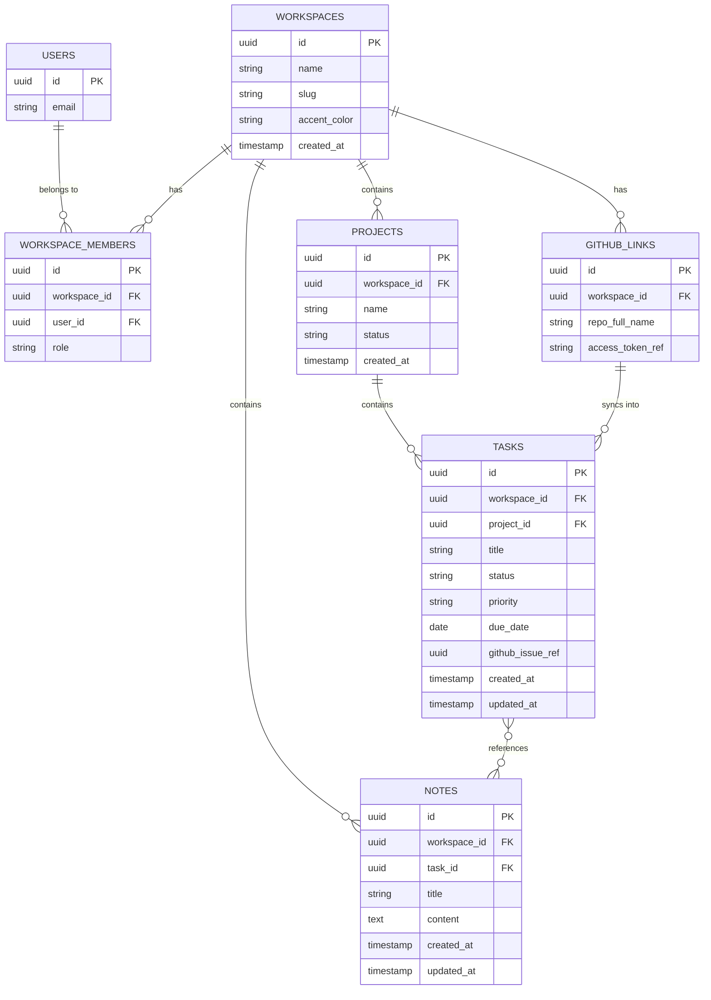

# Forge — Database Schema

**Status:** Draft v0.1
**Engine:** Postgres via Supabase, Row Level Security enforced on every table.

---

## 1. Entity Relationship Diagram



---

## 2. Tables

### `workspaces`
| Column | Type | Notes |
|---|---|---|
| `id` | uuid, PK | |
| `name` | text | e.g. "Nexflow" |
| `slug` | text, unique | URL-friendly identifier |
| `accent_color` | text | hex value, drives the workspace-switcher UI (see UI_GUIDELINES.md) |
| `created_at` | timestamptz | |

### `workspace_members`
| Column | Type | Notes |
|---|---|---|
| `id` | uuid, PK | |
| `workspace_id` | uuid, FK → workspaces | |
| `user_id` | uuid, FK → auth.users | |
| `role` | text | `owner` \| `member` (only `owner` exists until Phase 2) |

This table exists purely so Phase 2 (agency team) and Phase 3 (community) require inserting rows, not restructuring the schema — see ARCHITECTURE.md §4.

### `projects`
| Column | Type | Notes |
|---|---|---|
| `id` | uuid, PK | |
| `workspace_id` | uuid, FK | |
| `name` | text | |
| `status` | text | `active` \| `paused` \| `archived` |
| `created_at` | timestamptz | |

### `tasks`
| Column | Type | Notes |
|---|---|---|
| `id` | uuid, PK | |
| `workspace_id` | uuid, FK | denormalized for fast RLS checks, even though it's derivable via `project_id` |
| `project_id` | uuid, FK, nullable | a task can exist without a project (quick-capture) |
| `title` | text | |
| `status` | text | `todo` \| `in_progress` \| `done` |
| `priority` | text | `low` \| `medium` \| `high` |
| `due_date` | date, nullable | |
| `github_issue_ref` | text, nullable | e.g. `owner/repo#123`, set when synced from GitHub |
| `created_at` / `updated_at` | timestamptz | |

### `notes`
| Column | Type | Notes |
|---|---|---|
| `id` | uuid, PK | |
| `workspace_id` | uuid, FK | |
| `task_id` | uuid, FK, nullable | optional link to a task |
| `title` | text | |
| `content` | text | markdown |
| `created_at` / `updated_at` | timestamptz | |

### `github_links`
| Column | Type | Notes |
|---|---|---|
| `id` | uuid, PK | |
| `workspace_id` | uuid, FK, unique | one repo per workspace in MVP |
| `repo_full_name` | text | e.g. `aliyev/forge` |
| `access_token_ref` | text | reference into Supabase Vault, never the raw token in this table |

---

## 3. Row Level Security

Every table above has RLS **enabled** with a consistent shape:

```sql
alter table tasks enable row level security;

create policy "select_own_workspace" on tasks
  for select using (
    workspace_id in (
      select workspace_id from workspace_members where user_id = auth.uid()
    )
  );

create policy "modify_own_workspace" on tasks
  for all using (
    workspace_id in (
      select workspace_id from workspace_members where user_id = auth.uid()
    )
  );
```

The same two-policy pattern (`select_own_workspace`, `modify_own_workspace`) is repeated for `projects`, `notes`, and `github_links`. `workspace_members` itself has a simpler policy: a user can only see rows where `user_id = auth.uid()`.

**Non-negotiable rule for implementation:** no table containing venture data ships without RLS enabled before the first row is inserted. This is checked in code review (see CONTRIBUTING.md) — RLS is not something to "add later."

---

## 4. Indexes (v0.1 minimum)

```sql
create index idx_tasks_workspace_status on tasks(workspace_id, status);
create index idx_projects_workspace on projects(workspace_id);
create index idx_notes_workspace on notes(workspace_id);
```

These support the two most frequent queries: "open tasks in this workspace" (dashboard) and "notes in this workspace" (knowledge base search).

---
*Next document: API.md — the contract between the UI/CLI and the service layer defined in ARCHITECTURE.md.*
